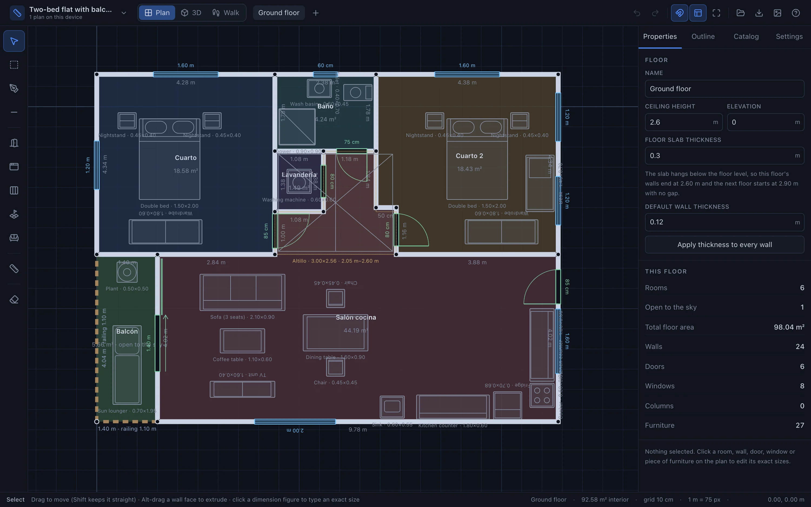
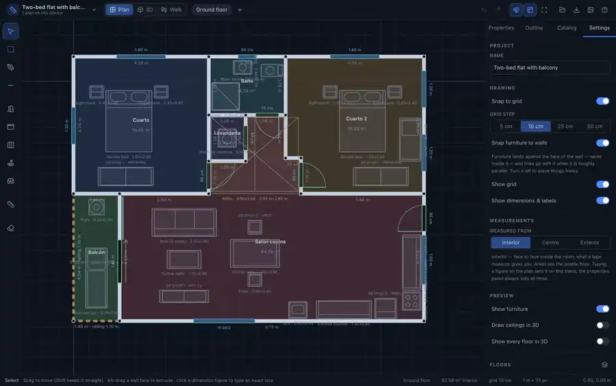
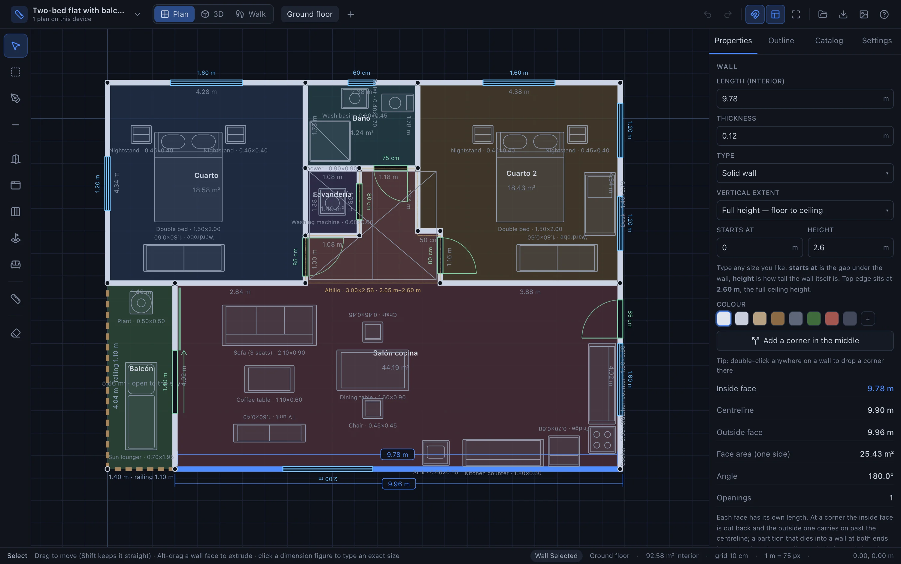
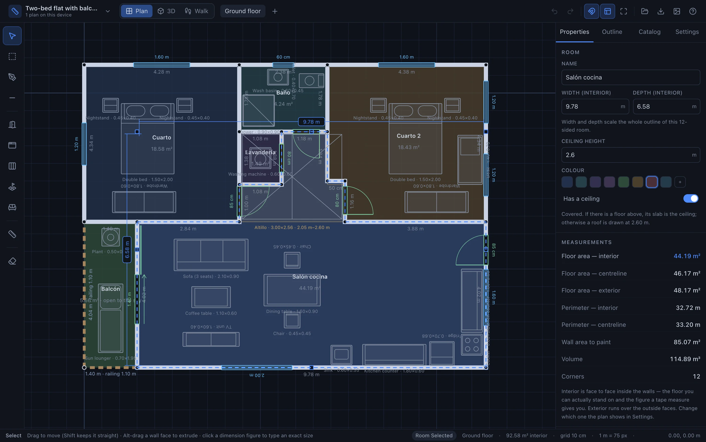
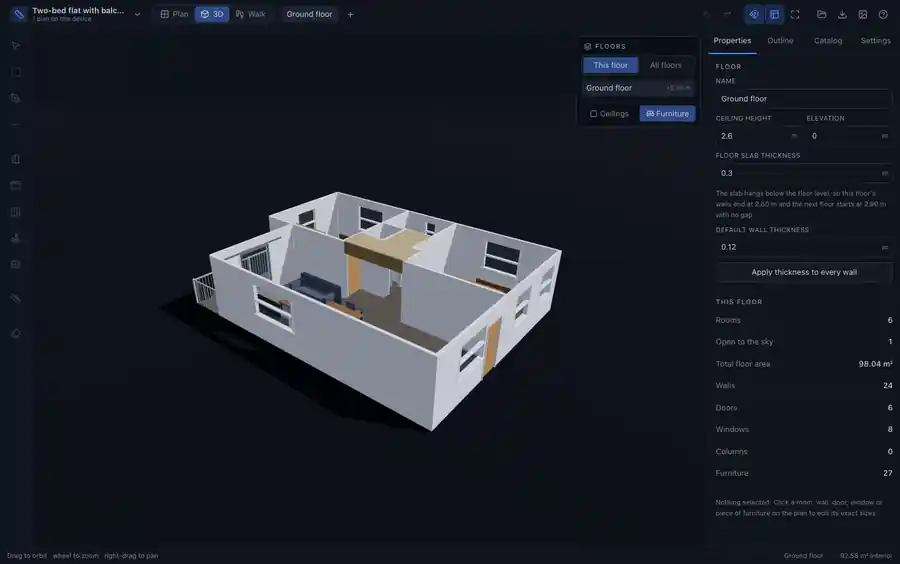
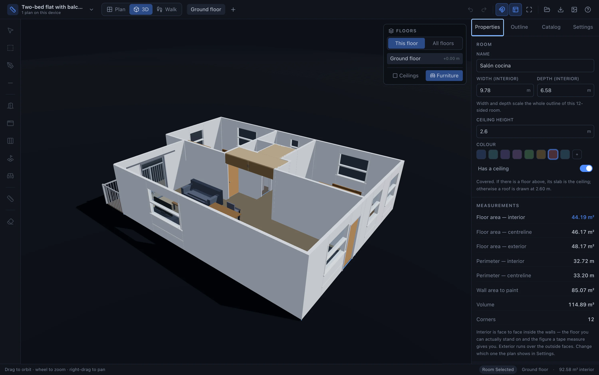
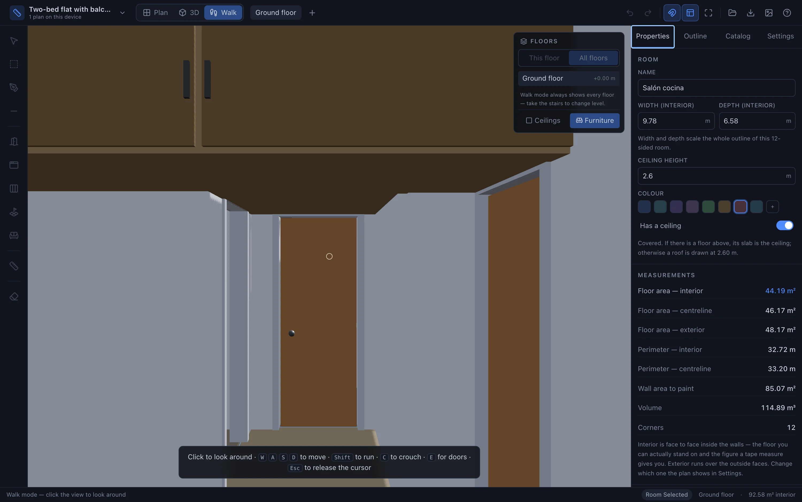
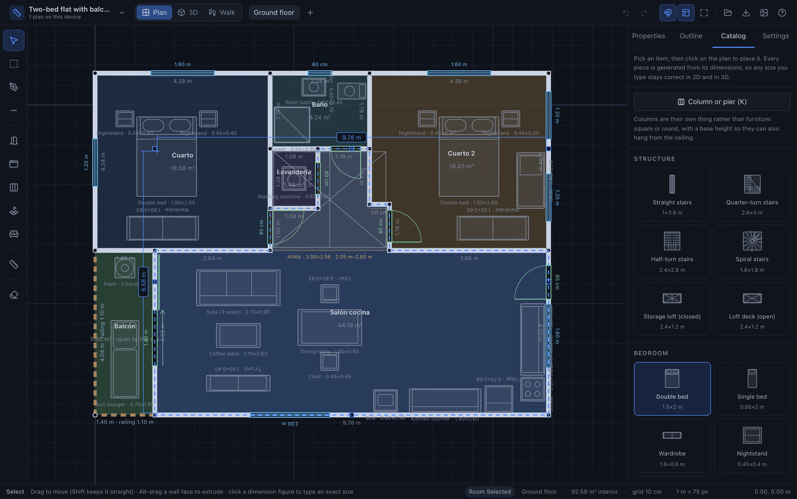

# Measure — Floor Plan Studio

Draw a flat to scale in the browser, measure every room, hang doors and windows on the walls, drop in
furniture, then look at it in 3D and walk through it at eye height.

Everything runs client-side. Your plan is saved in the browser and can be exported as JSON or PNG.



*Every picture in this README is a real screenshot of the app, taken by `npm run docs:shoot` — it builds the
project, serves it, and drives the actual UI in Chromium.*

## Measured the way you measure

Walls are stored as a centreline with a thickness, but nobody measures a room down the middle of its walls.
Settings → Measurements picks where every figure comes from: the interior faces (the clear, usable size — the
default), the centrelines, or the outside faces. Areas, dimension lines and anything you type follow it.



A selected wall is dimensioned on **both** of its faces, because at a corner one face is cut back and the other
carries on past the centreline. The panel lists all three lengths at once.



A room gives you its interior, centreline and exterior area together, plus the wall area to paint and the
volume. The dashed outline shows exactly what is being measured.



## In 3D

The plan is the model: walls with real thickness and mitred corners, openings cut through them, furniture
generated from its own dimensions. Click anything in 3D to select it and open its properties.





Then walk through it at eye height, with collision against walls and closed doors.



## Furniture catalogue

Every piece is generated from its width / depth / height, so any size you type is right in both 2D and 3D.
Nothing is downloaded.



## Getting started

The landing page explains the app, and a two-step wizard asks what you are drawing (studio, one-bed, two-bed,
family home with a roof terrace, the demo flat, or an empty canvas) plus your ceiling height, wall thickness
and your own height — then generates a real, editable home. You can keep as many plans as you like; they are
listed under the project name in the toolbar.

## Features

- **Rooms from walls** — draw walls freely; the moment they close a space it becomes a room, ready to name
  (double-click it on the plan). "Find rooms" adopts anything enclosed later, and "Tidy walls" splits walls at
  junctions and removes duplicates so neighbours share one wall.
- **Dimensions you can type into** — the selection is dimensioned on the plan; click a figure and type the
  exact size. A selected wall is dimensioned on *both* faces at once — the inside run and the outside run —
  because at a corner one face is cut back and the other carries on past it.
- **Straight drags** — hold Shift while dragging a corner, a wall, a room or a piece of furniture and it stays
  on one axis, exactly level with where it started.
- **Interior, centreline or exterior** — walls are stored as a centreline with a thickness, but nobody measures
  a room down the middle of its walls. Settings → Measurements picks where every figure is taken from: the
  interior faces (the clear, usable size — the default), the centrelines, or the outside faces. The plan draws
  a dashed line along the measured faces of the selected room, whatever you type is read on that same basis,
  and a room's properties list all three areas at once, plus the wall area to paint and the volume.
- **Rooms (estancias)** — rectangular rooms by dragging, or free polygons corner by corner. Each room has a
  name, colour, its own ceiling height, and live area / perimeter / volume figures.
- **Walls** — every edge is a real wall with its own thickness and height. Type an exact length and the wall
  resizes. Corners weld together, so neighbouring rooms share a single wall. Double-click a wall to drop a
  corner on it and bend the run around a column or a recess.
- **Extrude** — Alt-drag any wall face to pull it out (or push it in). The wall becomes three, the room
  outline follows, and openings travel with the face. Split a wall twice first and extrude the middle piece to
  get a column or a niche.
- **Partial walls** — every wall has a base height and a height, so it can be a full partition, a terrace
  parapet or a kerb (dashed on the plan), or a beam / boxing hanging from the ceiling that you walk under
  (dotted on the plan). One-click presets for each.
- **Columns & piers** — free-standing square or round structure with its own footprint, base and height:
  load-bearing pillars, plinths, or boxing over a duct. They block you in walk mode when they reach the floor,
  and let you pass when they only hang from the ceiling.
- **Resize grips** — the usual eight handles around the selection: drag to resize a room's outline or a piece
  of furniture, anchored on the opposite side.
- **Wall snapping** — furniture lands against the *face* of a wall (its thickness is respected, so nothing
  ends up buried inside it) and lines up with the wall when it is roughly parallel. Optional, toggled with
  `H`.
- **Doors & windows** — click a wall to place one, drag it along the wall, then set width, height, sill
  height, hinge side and swing direction. Doors can be hinged, **sliding**, or a **cased opening** with no leaf
  at all.
- **Altillos** — storage up at head height, either an open loft deck or a closed box with doors. The back edge
  takes a cut-out, so one loft can wrap around a room — over a hall and in front of a cupboard without covering
  it. Both are
  drawn dotted on the plan with their underside and top, and you walk underneath them. Openings are cut out of the 3D
  walls.
- **Furniture** — a catalogue of beds, wardrobes, sofas, kitchen units, sanitary ware, desks, stairs and more.
  Every piece is generated from its width / depth / height, so any size you type is correct in both 2D and 3D.
  No external assets to download.
- **A plot of land** — optional site the buildings stand on: any polygon, not just a rectangle. Draw it with
  `L`, drag its corners, add or remove them, and pick the ground (grass, gravel, sand, paving, earth). Draw as
  many separate buildings on it as you like.
- **Outdoors** — swimming pool, hot tub, cars, trees, hedges, planters, a garden bench, a shed and paving in
  the catalogue; fences, railings and hedges are wall types, so they take gates like any other wall.
- **Tape measure** — measure any two points on the plan.
- **Sample flat** — ships with a two-storey demo: ground floor with a terrace, a half wall screening the
  shower, a beam across the living room and a service duct, plus a staircase up to a 58 m² roof terrace with a
  barbecue, a pergola over the dining table and sun loungers (Settings → Reset to sample flat).
- **Multiple floors** — add or duplicate floors, each with its own elevation, ceiling height and slab
  thickness. The slab hangs below the floor level, so storeys stack solidly instead of floating.
- **Ceilings per room** — a room can be covered or open to the sky, so a terrace stays uncovered while the
  rooms beside it are roofed. Rooms under another floor use that floor's slab as their ceiling.
- **Several plans** — a library of projects in this browser, each openable, renameable, duplicable and
  exportable on its own.
- **Stairs** — straight, quarter-turn, half-turn or spiral flights, sized by width, run and rise. The step count, riser and going are worked out
  for you, the rise snaps to the floor above, the flight cuts its own well in the slab above it, and in walk
  mode you climb it — or come back down — between levels.
- **3D preview** — orbit around the model with real doors, glazed windows, shadows and optional ceilings.
- **Walk simulation** — first-person mouse-look with WASD, run, crouch, and collision against walls, columns
  and closed doors. Doors start closed: stand next to one and press `E` (or click) to swing or slide it open.
- **Pick in 3D** — click any wall, room, column, opening or piece of furniture in the 3D view to select it; it
  outlines in blue and its properties open on the right.
- **Undo / redo**, grid snapping, alignment guides, autosave, JSON import/export, PNG export.

## Keyboard

| Key | Action |
| --- | --- |
| `1` `2` `3` | Plan · 3D · Walk |
| `V` `R` `P` `W` | Select · Rectangular room · Polygon room · Wall |
| `D` `N` `K` `L` | Door · Window · Column · Plot outline |
| `I` `M` `X` | Furniture · Tape measure · Delete |
| `F` `G` `H` | Zoom to fit · Grid snapping · Snap furniture to walls |
| `Ctrl/⌘ Z` | Undo (add `Shift` to redo) |
| `Del` `C` | Delete / duplicate the selection |
| `Shift` | Keep it straight — horizontal / vertical while drawing, one axis while dragging |
| `Alt` + drag a wall face | Extrude it into a column, a recess or a bay |
| `Space` + drag | Pan with any tool |

## Development

```bash
npm install
npm run dev          # local dev server
npm run build        # type-check + production build into dist/
npm run preview      # serve the production build
npm run docs:shoot   # rebuild, then re-take the screenshots in this README
```

`docs:shoot` builds the app, serves `dist/` on a local port, drives it in headless Chromium (Playwright) and
writes the stills and clips into `docs/`. It needs `cwebp` and `ffmpeg` on the path
(`brew install webp ffmpeg`).

## Deployment

Pushing to `main` builds and publishes to GitHub Pages via `.github/workflows/deploy.yml`
(Settings → Pages → Source: **GitHub Actions**). The Vite `base` is relative, so the build also works from any
sub-path or static host.

## Stack

React 19 + TypeScript + Vite, Zustand (with zundo for history), react-konva for the 2D plan,
react-three-fiber / three.js for the 3D view and walkthrough, Tailwind CSS v4, lucide icons.
